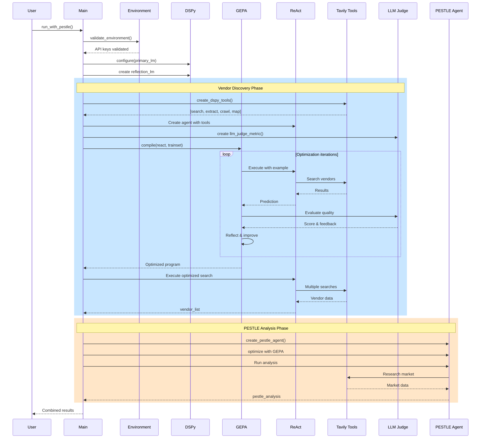
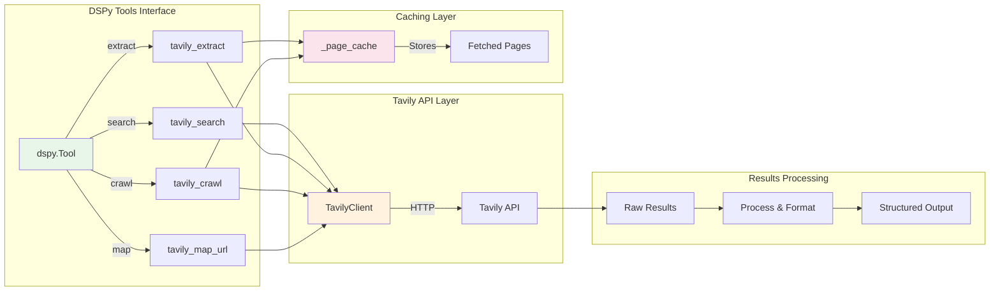
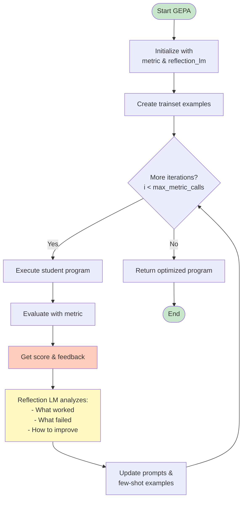
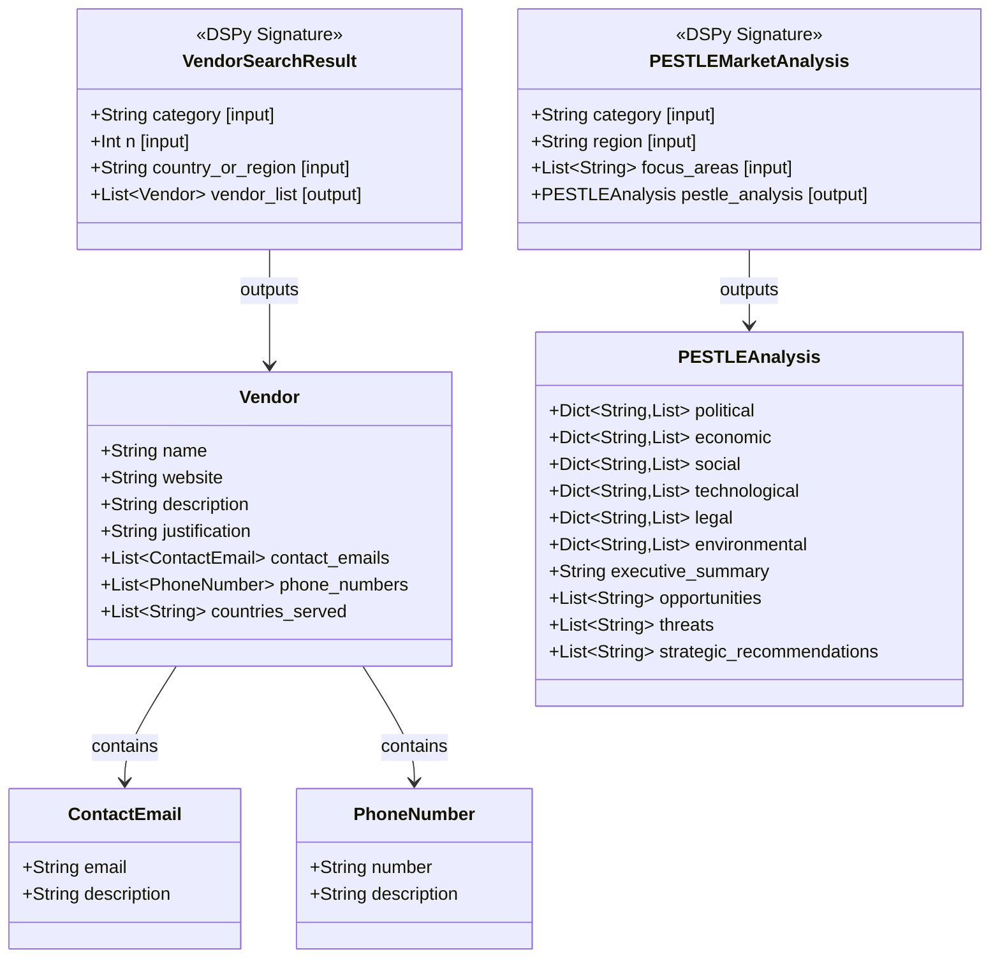
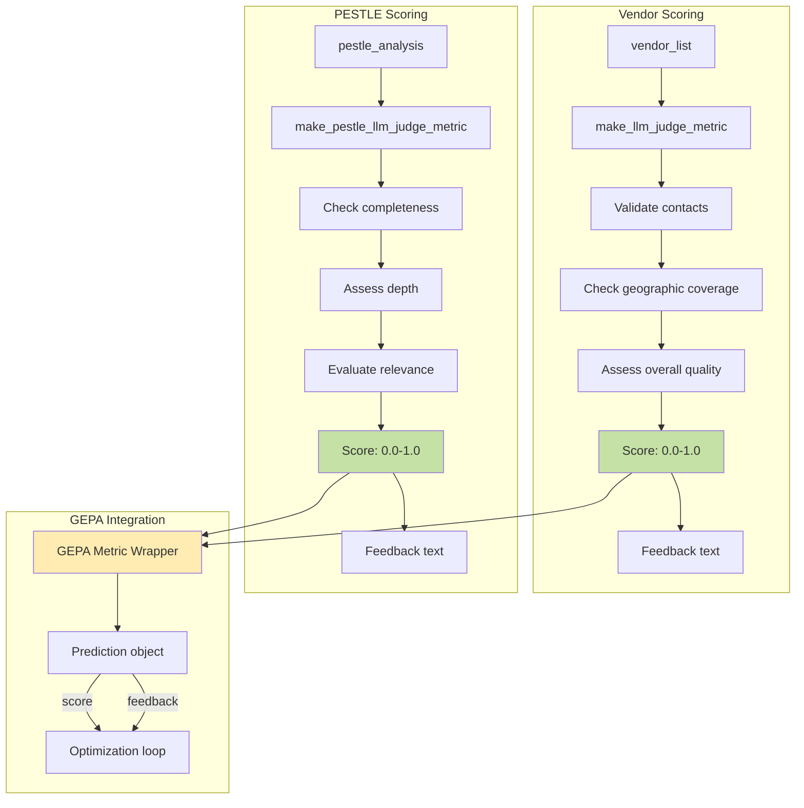
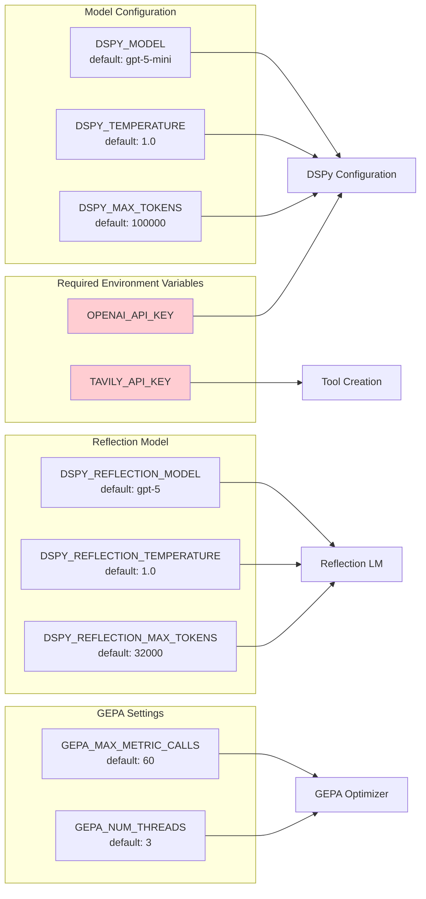
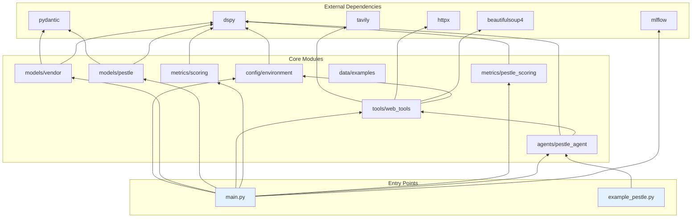

# RiseNow DSPy System Architecture Diagrams

## 1. System Component Overview

```mermaid
graph TB
    subgraph "Entry Points"
        M[main.py]
        EP[example_pestle.py]
    end

    subgraph "Configuration Layer"
        CE[config/environment.py]
        CE -->|Validates| ENV[Environment Variables]
        CE -->|Configures| LC[LM Configs]
        CE -->|Sets| GS[GEPA Settings]
    end

    subgraph "Model Layer"
        MV[models/vendor.py]
        MP[models/pestle.py]
        MV -->|Defines| VS[VendorSearchResult]
        MV -->|Contains| VM[Vendor Model]
        MP -->|Defines| PA[PESTLEAnalysis]
        MP -->|Contains| PMA[PESTLEMarketAnalysis]
    end

    subgraph "Agent Layer"
        AP[agents/pestle_agent.py]
        AP -->|Creates| RA[ReAct Agent]
        AP -->|Or| COT[ChainOfThought]
    end

    subgraph "Tool Layer"
        WT[tools/web_tools.py]
        WT -->|Wraps| TC[Tavily Client]
        WT -->|Provides| DST[DSPy Tools]
        WT -->|Caches| PC[Page Cache]
    end

    subgraph "Metrics Layer"
        MS[metrics/scoring.py]
        MPS[metrics/pestle_scoring.py]
        MS -->|Creates| LJ[LLM Judge]
        MPS -->|Creates| PLJ[PESTLE Judge]
    end

    subgraph "Data Layer"
        DE[data/examples.py]
        DE -->|Provides| TS[Training Sets]
    end

    subgraph "Optimization"
        GEPA[GEPA Optimizer]
        GEPA -->|Uses| REF[Reflection LM]
        GEPA -->|Optimizes| AGT[Agents]
    end

    M --> CE
    M --> MV
    M --> MS
    M --> WT
    M --> AP
    M --> GEPA

    EP --> AP
    EP --> MPS

    style M fill:#e1f5fe
    style EP fill:#e1f5fe
    style GEPA fill:#fff3e0
    style TC fill:#f3e5f5
```

## 2. Main Execution Flow

## 3. Tool Integration Architecture

## 4. GEPA Optimization Process

## 5. Data Models & Signatures

## 6. Scoring & Metrics Flow

## 7. Environment Configuration

## 8. Module Dependency Graph

## Summary

This system implements a sophisticated vendor discovery and market analysis pipeline using:

1. **DSPy Framework**: For prompt optimization and agent orchestration
2. **GEPA Optimization**: Few-shot reflective learning to improve agent performance
3. **Tavily Integration**: Web search and extraction capabilities
4. **Dual Analysis**: Both vendor discovery and PESTLE market analysis
5. **LLM-based Evaluation**: Automated quality scoring with feedback
6. **Modular Architecture**: Clear separation of concerns across layers

The system is designed to be extensible, with clear interfaces between components and comprehensive configuration options through environment variables.